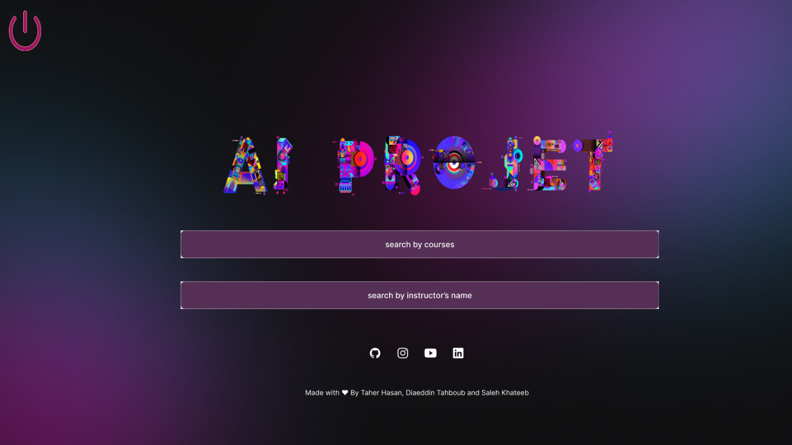
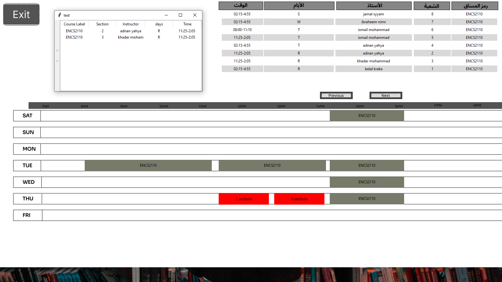

AI First Project.

**Course: AI – ENCS3340**

First semester 2022/2023

Diaeddin Tahboub – 1200136

Saleh Khatib -1200991

Taher Hasan - 1191740

Dr. Aziz Qaroush

1. Goal
This programming project can be viewed as an application of searching algorithms (local 
searching algorithms) in real world problems. 
2. Specifications: 
Developing a department courses distribution is not an easy task. It has many variables: 
time slots, courses, sections, student priorities, teacher priorities etc. The aim of this 
project is to distribute the department courses with max diversity. 
The aim of this project is to use Genetic algorithm to optimize the distribution of the
courses to achieve maximum diversity. The input for this project is the course browser 
of the current semester. Your program needs to have a reasonable interface that can 
easily show the distribution of the courses.

**Idea:** 

The project’s aim is to read the information about labs and courses (read the instructors, time of start and time of end for each course) and makes chromosomes for them. Then we apply crossover and mutation on them and take the best chromosome (has the best fitness function). Note: we change the sections of an instructor if there is a reflection of time in his labs/courses.

**Methods and function:**

1-readCour: to read courses and their instructors from the courses file.

2-readlab: to read the labs and their instructors from the labs file.
**
3-MakeFirChrom: to make chromosomes represented by 10 time slots, each time slot will be filled by multiple sections for courses.
**
4-MakePop: to the other chromosomes after making the first and to make the population so we can start the cross over.

3-Fit and FitHelp: Fit takes the first chromosome and graps each time slot in the chromosome, then for every time slot if we have more than one section for a course then we will talk the half of them and take, else if there is courses with the same year we will take just one section from one course, after that we will take the rest of the number of sections that fit left in the time slot and we add it to the one and the half (if exist). 

5-FitHelp: Calculates the fitness for a single time slot, but the Fit function calculates the fitness for all time slots in the chromosome using this function.

6-Crossover: Uses three functions(Unaited, ToForm, Realcro),

firstly we double the number of population, then Unaited takes two chromosomes and combine the sections that are inside the two chromosomes inside a new list, then the ToForm function swaps the indexes of the list. The RealCro function takes the two chromosomes and fill them from the mixed list, so we will have after that two chromosomes as a result of the crossover, and repeat all these steps for all the population, after  that we will calculate the fitness function for each chromosome in the population and the we return the one with the higher fitness function, if this fitness achieved the goal return it, take the best ten from the doubled population and repeat the crossing-over for them. Note: for 100 iteration we will make mutation for all the population.

7-DistrubTeach: Gives every teacher his section.

8-Fix: If the teacher has more than one section in the same time slot then we move the repeated section to another time slot.

9-FixL: If the teacher has more than one lab in the same time slot then we move the repeated lab to another time slot.

10-CopyLC: Combines the chromosome of the courses and the chromosome of the labs into one chromosome.

11-YaaaaRabee: Works like Fix function but for the combined chromosome.

12-TimeStr: Splits the time slots for labs and courses.

13-Save: Prints the output in the table file.

Note: The chromosome for the courses has 10 time slots, the first 5 time slots represents Monday courses and the other slots represents the Tuesday courses, we made this because the courses of Monday are reflected to Wednesday and Saturday and the courses of Tuesday are reflected to Thursday.

For labs we have 15 time slots and each 3 represents a day. 

Interface part:

In the first UI we can choose between searching by course label or instructor name as shown below…

After we have chosen the way we need to search, we can add any courses from the list if "Search by Course" is selected or if "Search by Instructor Name" is selected.

The table appears at the end. 

If we get a conflict between two or more sections, it will appear as a red button. If selected, the name of the conflicting sections and other details will appear.

